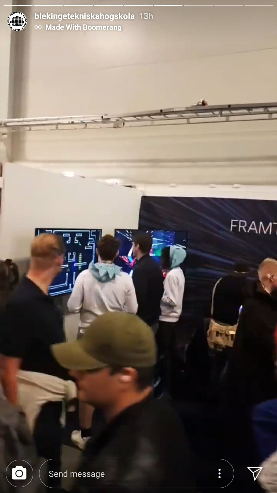
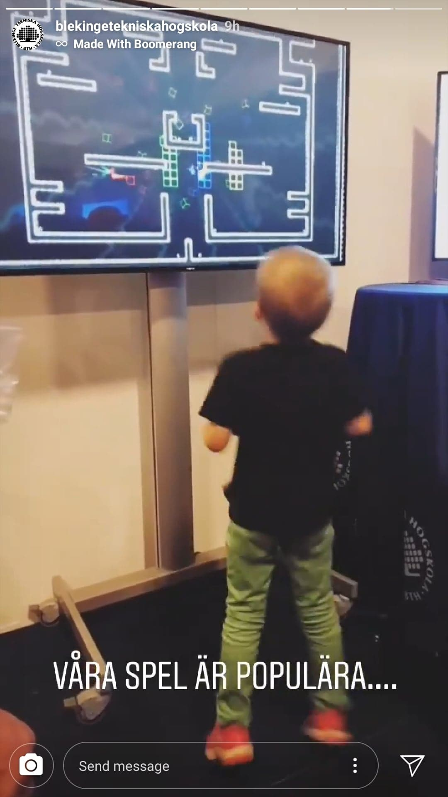

Welcome to my portfolio website! My name is Gustav and I have a Master of Science in Engineering degree in Game and Software Engineering from Blekinge Tekniska Högskola (BTH), Sweden. I am passionate about game development and have an especially big interest in game physics.
# I program games and stuff. 
# - Here are some of my projects: 
---

## S.P.L.A.S.H2O
Splash is a ray-traced online first-person shooter. The story is that a scientist has cloned himself in order to have someone to play games with. He then proceeds to turn off all the lights in his laboratory and give all his clones some candles and a water gun each. What happens next is a last man standing water fight where the goal is to eliminate other players by extinguishing their candles. The game can be played online with up to 12 players in the same game.

We were 12 students working together during the large game project at BTH. The game is made from scratch and I created the physics including collisions, raycasting, bounding boxes, octree as well as the particle effects framework/back end and frustum culling.

The repo is available [here!](https://github.com/BTH-StoraSpel-DXR/SPLASH "SPLASH repo")

<iframe src="https://www.youtube.com/embed/NXo2Lea5HGo" 
frameborder="0" allowfullscreen class="video"></iframe>

 

## SPASM
SPASM is a 2,5D arena shooter made by me and 4 other students during the small game project at BTH and is the result of 8 weeks of development from scratch. I contributed with creating models, animations, map building, block appearance and connections, score visualizations, and some varius gameplay related features.

The repo is available [here!](https://github.com/Piratkopia13/DV1504_SPASM "SPASM repo")

<iframe src="https://www.youtube.com/embed/ansdNcRM_0Q"
frameborder="0" allowfullscreen class="video"></iframe>

 
SPASM has been showcased by BTH at multiple events such as Comic Con Stockholm where the game was very appreciated. So much so that we have been recommended by BTH representatives to release the game on a platform like Steam. We would like to add online multiplayer support before releasing it, so let's see if it happens in the future. 

## Ludum Dare 49 - Un-stabled
I participated in Ludum Dare 49! The theme was "Unstable" and we went the punny way by making a game about getting out of the stable as a horse. Doing a game jam was super fun and I definitely want to do more of them!

Check the entry out [here!](https://ldjam.com/events/ludum-dare/49/un-stabled-5)

## Ludum Dare 50 - Mr. Fuse
For Ludum Dare 50, I ported the simple 2D engine we used for LD49 to typescript and WebGL. We made a foddian escort platformer where you move up a tower while bouncing a bomb, it's hard, but fun!

Check out the entry [here](https://ldjam.com/events/ludum-dare/50/mr-fuse) or play the game directly [here!](https://bjorkgustav.se/MrFuse/) (There are even touch controls so feel free to try it on your phone!)

## Ludum Dare 51 - Decachronomorphia
For Ludum Dare 51, I expanded the typescript and WebGL engine I made for LD50 to include 3D rendering and some more advanced 3D physics. We made a dungeon crawler which looks kind of nice, but we overscoped a bit, and ran out of time before we managed to balance the game properly. Oh well.  

Check out the entry [here](https://ldjam.com/events/ludum-dare/51/decachronomorphia) or play the game directly [here!](https://bjorkgustav.se/Decachronomorphia/)

## K2A web-based game
Written in HTML, CSS, and Javascript with WebGL as a freelance project ordered by the PR-agency [Redgert Comms](http://redgertcomms.com/ "Redgert Comms homepage") as a way to market the stock exchange listing of the company [K2A](https://www.k2a.se "K2A homepage").

 The game can be played [here!](./K2A "K2A Game")

## Master thesis on collision detection using neural networks
Check out my masters thesis which I conducted together with my classmate [Alexander Wester](https://pirat.dev). We experimented with using Neural Networks to detect collisions in 3D environments and comparing it to Separating Axis Theorem. We were able to achieve intersection testing 15.6 times as fast as when using Separating Axis Theorem.
 
[Link to publication](http://urn.kb.se/resolve?urn=urn:nbn:se:bth-19623 "DiVa publication")

---
## Links
[GitHub](https://github.com/Praccen "Github profile")

[Ludum Dare Profile](https://ldjam.com/users/praccen "LD profile")

[LinkedIn](https://www.linkedin.com/in/gustav-bj%C3%B6rk-47329a188 "LinkedIn profile")

[CV](./assets/CV_Gustav_Björk.pdf)
